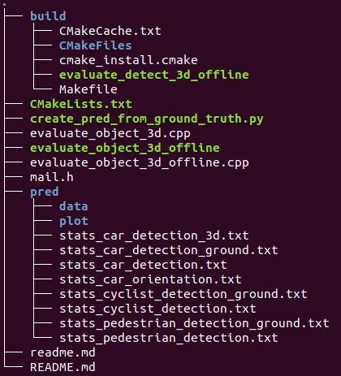

## task 1. 公式推导
---
>**question:**    
1）input: $127\times 10 \times 400 \times 352$   
 2）conv3D 1: 64 keneral(3,3,3),stride(2,1,1),padding(1,1,1)   
 3）conv3D 2: 64 keneral(3,3,3),stride(1,1,1),padding(0,1,1)   
 4）conv3D 3: 64 keneral(3,3,3),stride(2,1,1),padding(1,1,1)   
 5）output?

>**anwer:**    
1）每层卷积核的输出都是64，因此输出的samples为64   
2）经过第一层卷积，3D数据边缘均padding 1个数据，然后第一维度以移动步距离为2卷积，其他两维以步距为1卷积，那么，有:      
$d =  \lfloor (10   + 2*1 - 3)/2 \rfloor + 1=5$   
$h =  \lfloor (400 + 2*1 - 3)/1 \rfloor + 1=400$   
$w =  \lfloor (352 + 2*1 - 3)/1 \rfloor + 1=352$       
3）经过第二层卷积，3D数据均以步距为1卷积，然后第一维度边缘无padding，其他两维边缘均padding 1个数据，那么，有：   
$d =  \lfloor (5       + 2*0 - 3)/1 \rfloor + 1=3$   
$h =  \lfloor (400  + 2*1 - 3)/1 \rfloor + 1=400$   
$w =  \lfloor (352 + 2*1 - 3)/1 \rfloor + 1=352$     
 4）经过第三层卷积，3D数据边缘均padding 1个数据，然后第一维度以移动步距离为2卷积，其他两维以步距为1卷积，那么，有:      
$d =  \lfloor (3       + 2*1 - 3)/2 \rfloor + 1=2$   
$h =  \lfloor (400  + 2*1 - 3)/1 \rfloor + 1=400$   
$w =  \lfloor (352 + 2*1 - 3)/1 \rfloor + 1=352$     
 5）因此output size 为：$64\times 2 \times 400 \times 352$ 

 ## task 2.  run [PointRCNN](https://github.com/sshaoshuai/PointRCNN)
 -----
1. j将路径 /PointRCNN/output/rcnn/default/eval/epoch_no_number/val/final_result 中data文件夹 
   拷贝到路径 /home/zc/MyFile/git/dataset/kitti_eval/pred中，其中pred文件夹需新建
2. write the CmakeLists.txt  in 
 ```
#  CmakeLists.txt
cmake_minimum_required(VERSION 3.0)
project(evaluate_detect_3d_offline)
add_executable(evaluate_detect_3d_offline evaluate_object_3d_offline.cpp)
```
3. make generate  evaluate_detect_3d_offline
4. ./evaluate_detect_3d_offline gt_dir result_dir
 &emsp; 其中,    
  gt_dir = Dataset/KITTI/data_object_label_2/training/label_2;   
  result_dir = /home/zc/MyFile/git/dataset/kitti_eval/pred;
5. 最终运行结果



